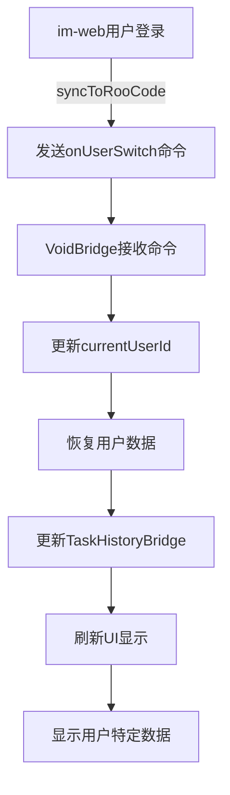
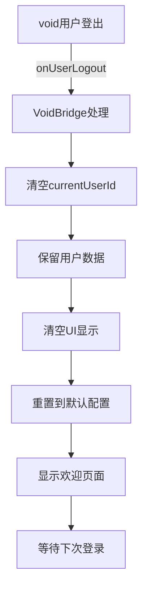
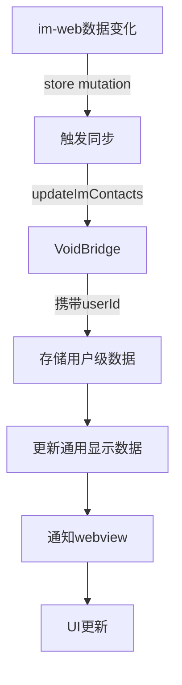

# Roo-Code 多用户数据隔离实施方案

## 概述

本文档描述了 Roo-Code 扩展中实现的多用户数据隔离方案，确保不同用户的数据（如 IM 联系人、任务历史、API 密钥等）能够正确隔离、切换和恢复。该方案支持用户登录、切换和登出场景，实现了数据的完全隔离和无缝切换。

## 更新历史

- **2024-12-28**: 初始实现，支持任务历史和 IM 联系人隔离
- **2024-12-28**: 增加 API 密钥的用户级隔离和恢复功能
- **2024-12-28**: 完善登出时的 Provider 状态清理，确保所有 API 密钥和配置完全清除
- **2024-12-28**: 实现 API 密钥的保存和恢复机制，支持用户重新登录后恢复之前的配置

## 核心架构

### 1. 用户标识管理

#### 1.1 用户ID存储

- **当前用户ID**：`VoidBridge.currentUserId` (静态变量)
- **持久化存储**：`globalState.get("lastUserId")`
- **自动恢复**：扩展启动时从 globalState 恢复上次用户ID

```typescript
// 启动时恢复
const lastUserId = context.globalState.get<string>("lastUserId")
if (lastUserId) {
	VoidBridge.currentUserId = lastUserId
	TaskHistoryBridge.setCurrentUserId(lastUserId)
}
```

#### 1.2 用户切换机制

- **显式切换**：通过 `roo-code.onUserSwitch` 命令
- **隐式切换**：通过 `roo-code.updateImContacts` 命令中的 userId 参数自动识别

### 2. 数据隔离策略

#### 2.1 存储键格式

所有用户相关数据使用统一的键格式：

```
user_${userId}_${dataKey}
```

示例：

- IM联系人：`user_123456_imContacts`
- 任务历史：`user_123456_taskHistory`

#### 2.2 数据存储位置

- **VSCode GlobalState**：持久化存储用户数据（IM 联系人、任务历史、Provider 配置）
- **VSCode Secrets**：安全存储 API 密钥和敏感信息
- **内存缓存**：临时存储当前用户信息

#### 2.3 API 密钥隔离

所有 API 密钥使用 VSCode Secrets API 进行安全存储，并使用用户前缀进行隔离：

```typescript
// SECRET_STATE_KEYS 定义的所有密钥
const SECRET_STATE_KEYS = [
	"apiKey",
	"anthropicApiKey",
	"openAiApiKey",
	"googleApiKey",
	"openRouterApiKey",
	"awsAccessKey",
	"awsSecretKey",
	"awsSessionToken",
	"gcpOpenAiApiKey",
] // 用户级密钥存储格式
`user_${userId}_${secretKey}`
```

### 3. 核心实现

#### 3.1 VoidBridge（用户数据桥接）

**文件**：`src/api/void-bridge.ts`

**主要功能**：

- 管理当前用户ID
- 处理用户切换和登出
- 管理用户级数据存储（包括 API 密钥）
- 实现数据保存和恢复机制

**核心方法**：

```typescript
// 获取用户特定的存储键
private static getUserKey(baseKey: string, userId?: string): string {
    const id = userId || VoidBridge.currentUserId
    return id ? `user_${id}_${baseKey}` : baseKey
}

// 用户切换命令 - 保存旧用户数据并恢复新用户数据
vscode.commands.registerCommand("roo-code.onUserSwitch", async (data) => {
    const previousUserId = VoidBridge.currentUserId

    // 保存前一个用户的数据
    if (previousUserId) {
        // 保存 IM 联系人
        const currentContacts = context.globalState.get("imContacts")
        if (currentContacts) {
            const userKey = VoidBridge.getUserKey("imContacts", previousUserId)
            await context.globalState.update(userKey, currentContacts)
        }

        // 保存任务历史
        if (VoidBridge.provider) {
            const currentHistory = VoidBridge.provider.contextProxy.getValue("taskHistory")
            if (currentHistory) {
                const historyKey = VoidBridge.getUserKey("taskHistory", previousUserId)
                await context.globalState.update(historyKey, currentHistory)
            }
        }

        // 保存 API 密钥到用户特定的 secrets
        for (const key of SECRET_STATE_KEYS) {
            const value = await context.secrets.get(key)
            if (value) {
                const userKey = VoidBridge.getUserKey(key, previousUserId)
                await context.secrets.store(userKey, value)
            }
        }

        // 保存 Provider 配置
        if (VoidBridge.provider) {
            const apiProvider = VoidBridge.provider.contextProxy.getValue("apiProvider")
            const currentApiConfig = VoidBridge.provider.contextProxy.getValue("currentApiConfigName")
            if (apiProvider) {
                const providerKey = VoidBridge.getUserKey("apiProvider", previousUserId)
                await context.globalState.update(providerKey, apiProvider)
            }
            if (currentApiConfig) {
                const configKey = VoidBridge.getUserKey("currentApiConfigName", previousUserId)
                await context.globalState.update(configKey, currentApiConfig)
            }
        }
    }

    // 更新当前用户ID
    VoidBridge.currentUserId = data.userId
    await context.globalState.update("lastUserId", data.userId)
    TaskHistoryBridge.setCurrentUserId(data.userId)

    // 恢复新用户的数据
    const userContactsKey = VoidBridge.getUserKey("imContacts", data.userId)
    const userContacts = context.globalState.get(userContactsKey)
    if (userContacts) {
        await context.globalState.update("imContacts", userContacts)
    } else {
        await context.globalState.update("imContacts", undefined)
    }

    // 恢复任务历史
    const userHistoryKey = VoidBridge.getUserKey("taskHistory", data.userId)
    const userHistory = context.globalState.get(userHistoryKey)
    if (VoidBridge.provider) {
        await VoidBridge.provider.contextProxy.setValue("taskHistory", userHistory || [])
    }

    // 清除当前 API 密钥
    for (const key of SECRET_STATE_KEYS) {
        await context.secrets.delete(key)
    }

    // 恢复用户的 API 密钥
    for (const key of SECRET_STATE_KEYS) {
        const userKey = VoidBridge.getUserKey(key, data.userId)
        const value = await context.secrets.get(userKey)
        if (value) {
            await context.secrets.store(key, value)
        }
    }

    // 恢复 Provider 配置
    if (VoidBridge.provider) {
        const providerKey = VoidBridge.getUserKey("apiProvider", data.userId)
        const configKey = VoidBridge.getUserKey("currentApiConfigName", data.userId)

        const apiProvider = context.globalState.get(providerKey)
        const currentApiConfig = context.globalState.get(configKey)

        if (apiProvider) {
            await VoidBridge.provider.contextProxy.setValue("apiProvider", apiProvider)
        }
        if (currentApiConfig) {
            await VoidBridge.provider.contextProxy.setValue("currentApiConfigName", currentApiConfig)
        }

        // 清除缓存并刷新
        await VoidBridge.provider.removeClineFromStack()
        await VoidBridge.provider.postStateToWebview()
    }
})

// 用户登出命令 - 保存数据、清空显示、清除 API 密钥
vscode.commands.registerCommand("roo-code.onUserLogout", async (data) => {
    const previousUserId = VoidBridge.currentUserId

    // 清空用户ID跟踪
    VoidBridge.currentUserId = undefined
    TaskHistoryBridge.setCurrentUserId(undefined)
    await context.globalState.update("lastUserId", undefined)

    // 清空显示数据
    await context.globalState.update("imContacts", undefined)

    // 保存当前用户的数据（如果存在）
    if (previousUserId && VoidBridge.provider) {
        // 保存 API 密钥到用户特定的 secrets
        for (const key of SECRET_STATE_KEYS) {
            const value = await context.secrets.get(key)
            if (value) {
                const userKey = VoidBridge.getUserKey(key, previousUserId)
                await context.secrets.store(userKey, value)
            }
        }

        // 保存 Provider 配置
        const apiProvider = VoidBridge.provider.contextProxy.getValue("apiProvider")
        const currentApiConfig = VoidBridge.provider.contextProxy.getValue("currentApiConfigName")
        if (apiProvider) {
            const providerKey = VoidBridge.getUserKey("apiProvider", previousUserId)
            await context.globalState.update(providerKey, apiProvider)
        }
        if (currentApiConfig) {
            const configKey = VoidBridge.getUserKey("currentApiConfigName", previousUserId)
            await context.globalState.update(configKey, currentApiConfig)
        }
    }

    // 清除所有当前 API 密钥
    for (const key of SECRET_STATE_KEYS) {
        await context.secrets.delete(key)
    }

    if (VoidBridge.provider) {
        // 清除所有 Provider 配置状态
        await VoidBridge.provider.contextProxy.setValue("apiProvider", undefined)
        await VoidBridge.provider.contextProxy.setValue("currentApiConfigName", undefined)
        await VoidBridge.provider.contextProxy.setValue("listApiConfigMeta", [])

        // 清除所有 Provider 相关字段
        const providerFields = [
            "apiModelId", "apiBaseUrl", "apiModelInfo",
            "awsRegion", "awsProfile",
            "vertexProjectId", "vertexRegion",
            "ollamaModelIds", "lmStudioModelIds",
            "openAiBaseUrl", "openAiHeaders", "openAiModelIds", "openAiStreamingEnabled",
            "anthropicBaseUrl", "anthropicHeaders",
            "vsCodeLmModelSelector"
        ]

        for (const field of providerFields) {
            await VoidBridge.provider.contextProxy.setValue(field, undefined)
        }

        // 清空任务历史显示
        await VoidBridge.provider.contextProxy.setValue("taskHistory", [])

        // 终止任何正在运行的任务
        const currentTask = VoidBridge.provider.getCurrentCline()
        if (currentTask) {
            await currentTask.abortTask()
        }

        // 移除当前任务
        await VoidBridge.provider.removeClineFromStack()

        // 刷新 secrets 缓存
        await VoidBridge.provider.contextProxy.refreshSecrets()

        // 通知 webview
        await VoidBridge.provider.postMessageToWebview({
            type: "userLoggedOut",
            userId: "",
        })

        // 刷新状态
        await VoidBridge.provider.postStateToWebview()
    }
})

// 更新IM联系人（支持自动用户切换）
vscode.commands.registerCommand("roo-code.updateImContacts", async (data) => {
    const userId = data.userId || VoidBridge.currentUserId

    // 自动识别并切换用户
    if (data.userId && data.userId !== VoidBridge.currentUserId) {
        VoidBridge.currentUserId = data.userId
        await context.globalState.update("lastUserId", data.userId)
        TaskHistoryBridge.setCurrentUserId(data.userId)
    }

    const contactsData = {
        friends: data.friends || [],
        groups: data.groups || [],
        lastUpdated: Date.now(),
    }

    // 存储用户级数据
    if (userId) {
        const userKey = VoidBridge.getUserKey("imContacts", userId)
        await context.globalState.update(userKey, contactsData)
    }

    // 同时更新通用键供当前显示使用
    await context.globalState.update("imContacts", contactsData)
})
```

#### 3.2 TaskHistoryBridge（任务历史管理）

**文件**：`src/api/task-history-bridge.ts`

**主要功能**：

- 管理用户级任务历史
- 同步用户ID到任务管理
- 支持任务的用户归属更新

**核心实现**：

```typescript
export class TaskHistoryBridge {
    private static currentUserId: string | undefined
    private static extensionContext: vscode.ExtensionContext | undefined

    // 设置当前用户ID
    static setCurrentUserId(userId: string | undefined) {
        TaskHistoryBridge.currentUserId = userId
    }

    // 获取用户特定的存储键
    private static getUserKey(baseKey: string, userId?: string): string {
        const id = userId || TaskHistoryBridge.currentUserId
        return id ? `user_${id}_${baseKey}` : baseKey
    }

    // 获取任务历史（支持用户级隔离）
    static getTaskHistory(context?: vscode.ExtensionContext, userId?: string): HistoryItem[] {
        const ctx = context || TaskHistoryBridge.extensionContext
        if (!ctx) return []

        // 尝试获取用户特定的任务历史
        const effectiveUserId = userId || TaskHistoryBridge.currentUserId
        if (effectiveUserId) {
            const userKey = TaskHistoryBridge.getUserKey("taskHistory", effectiveUserId)
            const userHistory = ctx.globalState.get(userKey) as HistoryItem[]
            if (userHistory) {
                return userHistory
            }
        }

        // 降级到通用任务历史
        return ctx.globalState.get("taskHistory") as HistoryItem[] || []
    }

    // 更新任务历史
    static async updateTaskHistory(context?: vscode.ExtensionContext, history?: HistoryItem[]): Promise<void> {
        const ctx = context || TaskHistoryBridge.extensionContext
        if (!ctx || !history) return

        // 更新通用历史（向后兼容）
        await ctx.globalState.update("taskHistory", history)

        // 同时更新用户级历史
        if (TaskHistoryBridge.currentUserId) {
            const userKey = TaskHistoryBridge.getUserKey("taskHistory")
            await ctx.globalState.update(userKey, history)
        }
    }

    // 注册更新任务用户ID命令
    vscode.commands.registerCommand("roo-cline.updateTaskUserId", async (pattern, userId) => {
        // 设置当前用户ID
        TaskHistoryBridge.setCurrentUserId(userId)

        // 获取并通知任务历史更新
        const taskHistory = TaskHistoryBridge.getTaskHistory(context)
        await vscode.commands.executeCommand("void.onTaskHistoryUpdated", {
            tasks: taskHistory,
            activeTaskId: provider.getCurrentCline()?.taskId,
            userId: userId,
        })
    })
}
```

#### 3.3 WebviewMessageHandler（数据请求处理）

**文件**：`src/core/webview/webviewMessageHandler.ts`

**获取用户数据逻辑**：

```typescript
case "getImContacts": {
    // 1. 尝试获取当前用户ID
    const userInfo = await vscode.commands.executeCommand("roo-code.getCurrentUser")

    // 2. 根据用户ID获取数据
    if (userInfo?.userId) {
        const userKey = `user_${userInfo.userId}_imContacts`
        const userContacts = provider.context.globalState.get(userKey)
        if (userContacts) {
            imContacts = userContacts
        }
    }

    // 3. 降级到通用数据
    if (!imContacts) {
        imContacts = getGlobalState("imContacts")
    }
}
```

#### 3.4 switchToDefaultConfig 命令

**文件**：`src/activate/registerCommands.ts`

**功能**：重置到默认配置，清空任务显示但保留provider配置

```typescript
switchToDefaultConfig: async () => {
	// 清空当前任务
	await currentProvider.removeClineFromStack()

	// 清空任务历史显示（但不删除存储的数据）
	await currentProvider.contextProxy.setValue("taskHistory", [])

	// 刷新webview状态
	await currentProvider.postStateToWebview()

	return { success: true }
}
```

## 数据流程

### 用户登录/切换流程



### 用户登出流程



### 数据同步流程



## im-web 端实现

### 1. Store 同步实现

**文件**：`/Users/david/ThinkgsProjects/box-im/im-web/src/store/index.js`

```javascript
// 添加同步到 RooCode 的 action
actions: {
    syncToRooCode({ state }) {
        const userInfo = state.userStore.userInfo
        const userId = userInfo ? String(userInfo.id) : undefined

        if (userId) {
            // 同步用户切换
            window.vscodeServices.get('ICommandService').executeCommand(
                'roo-cline.onUserSwitch',
                { userId, userName: userInfo.nickName }
            )

            // 同步联系人数据
            const friends = state.friendStore.friends.filter(f => !f.deleted)
            const groups = state.groupStore.groups.filter(g => !g.quit && !g.dissolve)

            window.vscodeServices.get('ICommandService').executeCommand(
                'roo-cline.updateImContacts',
                { userId, friends, groups }
            )
        }
    },

    handleLogout({ dispatch }) {
        // 通知 RooCode 用户登出
        window.vscodeServices.get('ICommandService').executeCommand(
            'roo-cline.onUserLogout',
            { isLoggedOut: true }
        )
    }
}
```

### 2. 数据变化自动同步

**文件**：`/Users/david/ThinkgsProjects/box-im/im-web/src/store/friendStore.js`

```javascript
mutations: {
    setFriends(state, friends) {
        state.friends = friends

        // 自动同步到 RooCode
        if (window.vscodeServices?.get('ICommandService')) {
            const userId = String(this.state.userStore.userInfo?.id)
            window.vscodeServices.get('ICommandService').executeCommand(
                'roo-cline.updateImContacts',
                {
                    userId,
                    friends: friends.filter(f => !f.deleted),
                    groups: this.state.groupStore.groups.filter(g => !g.quit)
                }
            ).catch(() => {})
        }
    }
}
```

### 3. 初始化同步

**文件**：`/Users/david/ThinkgsProjects/box-im/im-web/src/main.js`

```javascript
// Vue 应用挂载完成后同步数据
app.$mount("#app")
app.$nextTick(() => {
	if (store.state.userStore.userInfo) {
		store.dispatch("syncToRooCode")
	}
})
```

## 关键特性

### 1. 数据隔离但不删除

- **用户登出时**：数据被隐藏但不删除，存储在 `user_${userId}_${dataKey}` 中
- **用户重新登录**：自动恢复该用户的所有历史数据
- **用户切换**：立即切换到新用户的数据集

### 2. UI 状态同步

- **登出时清空显示**：
    - 任务历史清空
    - IM 联系人清空
    - 显示欢迎页面
- **登录时恢复显示**：
    - 恢复用户的任务历史
    - 恢复用户的 IM 联系人
    - 恢复上次工作状态

### 3. API 密钥安全隔离

- **登出时保存**：API 密钥保存到用户特定的 secrets 存储
- **登出后清除**：清除所有当前 API 密钥，防止泄露
- **重新登录恢复**：自动从用户 secrets 恢复所有 API 密钥
- **完全隔离**：每个用户的 API 密钥完全独立，互不影响

### 4. Provider 状态完全清理

登出时彻底清除所有 Provider 相关状态：

- API Provider 类型
- API 配置名称
- 所有模型配置
- 所有认证信息
- 防止缓存的凭证被误用

## 命令注册

### package.json 声明

```json
{
	"contributes": {
		"commands": [
			{
				"command": "roo-cline.onUserSwitch",
				"title": "Handle user switch"
			},
			{
				"command": "roo-cline.onUserLogout",
				"title": "Handle user logout"
			},
			{
				"command": "roo-cline.updateImContacts",
				"title": "Update IM contacts"
			},
			{
				"command": "roo-cline.getImContacts",
				"title": "Get IM contacts"
			},
			{
				"command": "roo-cline.getCurrentUser",
				"title": "Get current user"
			},
			{
				"command": "roo-cline.switchToDefaultConfig",
				"title": "Switch to default config"
			},
			{
				"command": "roo-cline.updateTaskUserId",
				"title": "Update task user ID"
			}
		]
	}
}
```

### TypeScript 类型定义

**文件**：`packages/types/src/vscode.ts`

```typescript
export const commandIds = [
	// ... 其他命令
	"switchToDefaultConfig",
	// ... 其他命令
] as const
```

**文件**：`src/shared/ExtensionMessage.ts`

```typescript
export interface ExtensionMessage {
	type: // ... 其他类型
	"userSwitched" | "userLoggedOut" | "imContactsResponse"
	// ... 其他字段
}
```

## 测试验证

### 1. 用户切换测试

- ✅ 切换用户后数据正确隔离
- ✅ 重启 VSCode 后用户ID正确恢复
- ✅ 联系人数据按用户正确显示
- ✅ 任务历史按用户正确切换

### 2. 用户登出测试

- ✅ 登出后 UI 清空所有用户数据
- ✅ 登出后显示欢迎页面
- ✅ 登出后 provider 配置保留
- ✅ 登出后用户数据仍保存在 storage 中

### 3. 数据恢复测试

- ✅ 用户重新登录后恢复历史数据
- ✅ 恢复的数据包括任务历史和联系人
- ✅ UI 正确显示恢复的数据

### 4. 数据同步测试

- ✅ im-web 更新数据后 RooCode 正确接收
- ✅ 用户ID自动识别功能正常
- ✅ store mutation 自动触发同步

## 故障排查

### 常见问题

1. **登出后仍显示数据**

    - 检查 `contextProxy.setValue("taskHistory", [])` 是否执行
    - 确认 `postStateToWebview()` 被调用
    - 验证 webview 收到 `userLoggedOut` 消息

2. **切换用户数据未更新**

    - 检查 userId 是否正确传递
    - 确认 `TaskHistoryBridge.setCurrentUserId()` 被调用
    - 验证数据存储键格式正确

3. **命令未找到错误**
    - 确认命令在 package.json 中声明
    - 检查命令在 VoidBridge.register() 中注册
    - 验证 CommandId 类型包含该命令

### 日志位置

- VoidBridge 日志：`[VoidBridge]` 前缀
- TaskHistoryBridge 日志：`[TaskHistoryBridge]` 前缀
- WebviewMessageHandler 日志：`[WebviewMessageHandler]` 前缀

## 安全性考虑

### API 密钥保护

1. **使用 VSCode Secrets API**：所有 API 密钥通过 VSCode 的安全存储机制保存
2. **用户级隔离**：每个用户的密钥使用独立的存储键
3. **登出时清除**：确保登出后没有密钥残留在内存或当前配置中
4. **防止任务泄露**：登出时终止所有正在运行的任务，防止使用旧凭证

### 数据隐私

1. **数据不混淆**：不同用户的数据完全隔离
2. **历史记录隔离**：任务历史按用户独立存储
3. **联系人隔离**：IM 联系人按用户独立管理

## 总结

本多用户数据隔离方案实现了以下核心功能：

1. **完全的数据隔离**：每个用户的数据独立存储，互不影响
2. **无缝的用户切换**：快速切换用户并恢复其数据
3. **智能的登出处理**：隐藏但不删除数据，支持快速恢复
4. **自动的数据同步**：im-web 变化自动同步到 RooCode
5. **友好的 UI 体验**：登出显示欢迎页，登录恢复工作状态
6. **API 密钥安全**：完整的密钥隔离、保存和恢复机制
7. **Provider 状态清理**：防止缓存凭证被误用

该方案成功解决了多用户环境下的数据混淆和安全问题，确保了数据安全性和用户体验的一致性。通过简化的架构设计（直接使用前缀键而非复杂的管理器），实现了高效且可靠的多用户支持。
