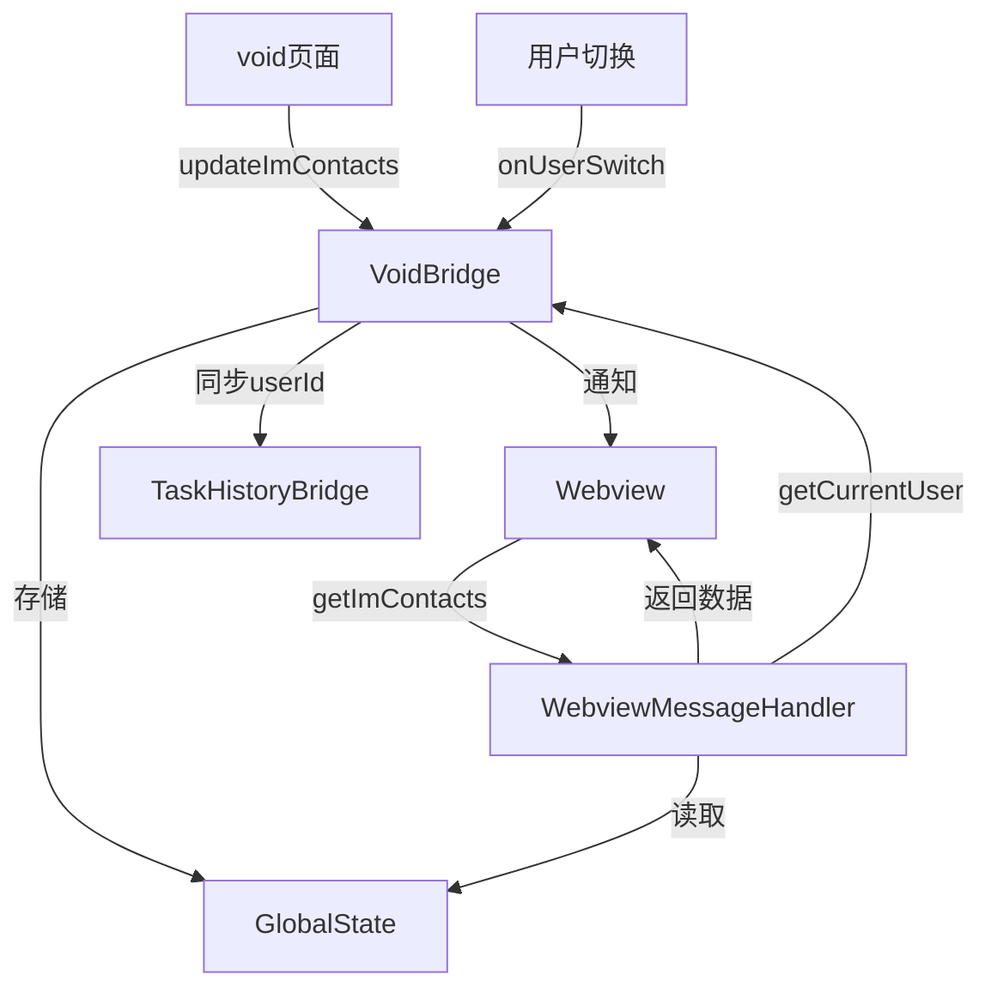

# 多用户数据隔离方案文档

## 概述

本文档描述了 Roo-Code 扩展中实现的多用户数据隔离方案，确保不同用户的数据（如 IM 联系人、任务历史等）能够正确隔离和切换。

## 核心架构

### 1. 用户标识管理

#### 1.1 用户ID存储

- **当前用户ID**：`VoidBridge.currentUserId` (静态变量)
- **持久化存储**：`globalState.get("lastUserId")`
- **自动恢复**：扩展启动时从 globalState 恢复上次用户ID

```typescript
// 启动时恢复
const lastUserId = context.globalState.get<string>("lastUserId")
if (lastUserId) {
	VoidBridge.currentUserId = lastUserId
	TaskHistoryBridge.setCurrentUserId(lastUserId)
}
```

#### 1.2 用户切换机制

- **显式切换**：通过 `roo-code.onUserSwitch` 命令
- **隐式切换**：通过 `roo-code.updateImContacts` 命令中的 userId 参数自动识别

### 2. 数据隔离策略

#### 2.1 存储键格式

所有用户相关数据使用统一的键格式：

```
user_${userId}_${dataKey}
```

示例：

- IM联系人：`user_123456_imContacts`
- 任务历史：`user_123456_taskHistory`

#### 2.2 数据存储位置

- **VSCode GlobalState**：持久化存储用户数据
- **内存缓存**：临时存储当前用户信息

### 3. 核心组件实现

#### 3.1 VoidBridge（用户数据桥接）

**文件**：`src/api/void-bridge.ts`

**主要功能**：

- 管理当前用户ID
- 处理用户切换
- 管理用户级数据存储

**核心方法**：

```typescript
// 获取用户特定的存储键
private static getUserKey(baseKey: string, userId?: string): string {
    const id = userId || VoidBridge.currentUserId
    return id ? `user_${id}_${baseKey}` : baseKey
}

// 用户切换命令
vscode.commands.registerCommand("roo-code.onUserSwitch", async (data) => {
    // 保存用户ID
    VoidBridge.currentUserId = data.userId
    await context.globalState.update("lastUserId", data.userId)

    // 同步到其他组件
    TaskHistoryBridge.setCurrentUserId(data.userId)

    // 通知 Webview
    await provider.postMessageToWebview({
        type: "userSwitched",
        userId: data.userId
    })
})

// 更新IM联系人（支持自动用户切换）
vscode.commands.registerCommand("roo-code.updateImContacts", async (data) => {
    // 自动识别并切换用户
    if (data.userId && data.userId !== VoidBridge.currentUserId) {
        VoidBridge.currentUserId = data.userId
        await context.globalState.update("lastUserId", data.userId)
        TaskHistoryBridge.setCurrentUserId(data.userId)
    }

    // 存储用户级数据
    const userKey = VoidBridge.getUserKey("imContacts", data.userId)
    await context.globalState.update(userKey, contactsData)
})
```

#### 3.2 TaskHistoryBridge（任务历史管理）

**文件**：`src/api/task-history-bridge.ts`

**主要功能**：

- 管理用户级任务历史
- 同步用户ID到任务管理

**核心实现**：

```typescript
export class TaskHistoryBridge {
	private static currentUserId: string | undefined

	static setCurrentUserId(userId: string) {
		TaskHistoryBridge.currentUserId = userId
	}

	private static getUserKey(baseKey: string): string {
		return TaskHistoryBridge.currentUserId ? `user_${TaskHistoryBridge.currentUserId}_${baseKey}` : baseKey
	}
}
```

#### 3.3 WebviewMessageHandler（数据请求处理）

**文件**：`src/core/webview/webviewMessageHandler.ts`

**获取用户数据逻辑**：

```typescript
case "getImContacts": {
    // 1. 尝试获取当前用户ID
    const userInfo = await vscode.commands.executeCommand("roo-code.getCurrentUser")

    // 2. 根据用户ID获取数据
    if (userInfo?.userId) {
        const userKey = `user_${userInfo.userId}_imContacts`
        const userContacts = provider.context.globalState.get(userKey)
        if (userContacts) {
            imContacts = userContacts
        }
    }

    // 3. 降级到通用数据
    if (!imContacts) {
        imContacts = getGlobalState("imContacts")
    }
}
```

## 数据流程图



## VSCode（void）端需要执行的操作

### 1. 初始化时获取并设置用户信息

```javascript
// 在 void 初始化完成后，发送当前用户信息
async function initializeUser() {
	const currentUser = getCurrentUserFromVueStore() // 从 __VUE_STORE__ 获取
	if (currentUser?.userId) {
		await vscode.postMessage({
			command: "roo-code.onUserSwitch",
			data: {
				userId: currentUser.userId,
				userName: currentUser.userName,
			},
		})
	}
}
```

### 2. 用户切换时通知扩展

```javascript
// 监听用户切换事件
watch(
	() => store.state.user.currentUser,
	async (newUser, oldUser) => {
		if (newUser?.userId !== oldUser?.userId) {
			await vscode.postMessage({
				command: "roo-code.onUserSwitch",
				data: {
					userId: newUser.userId,
					userName: newUser.userName,
				},
			})
		}
	},
)
```

### 3. 更新联系人数据时携带用户ID

```javascript
// 更新 IM 联系人时，必须携带 userId
async function updateImContacts(friends, groups) {
	const currentUser = store.state.user.currentUser
	await vscode.postMessage({
		command: "roo-code.updateImContacts",
		data: {
			userId: currentUser?.userId, // 重要：必须携带用户ID
			friends: friends || [],
			groups: groups || [],
		},
	})
}
```

### 4. 定期同步机制

```javascript
// 每30秒同步一次数据
setInterval(async () => {
	const currentUser = store.state.user.currentUser
	if (currentUser?.userId) {
		// 同步联系人
		await updateImContacts(store.state.im.friends, store.state.im.groups)

		// 同步任务历史
		await vscode.postMessage({
			command: "roo-code.updateTaskHistory",
			data: {
				userId: currentUser.userId,
				tasks: store.state.tasks.history,
			},
		})
	}
}, 30000)
```

## 注意事项

### 1. 向后兼容性

- 系统同时维护用户级键和通用键
- 优先使用用户级数据，降级到通用数据
- 确保旧版本能够继续工作

### 2. 数据一致性

- 用户切换时清理 Webview 缓存
- 所有组件同步更新用户ID
- 持久化存储确保重启后数据不丢失

### 3. 性能考虑

- 使用内存缓存减少 GlobalState 读取
- 批量更新减少存储操作
- 定期同步而非实时同步

### 4. 安全性

- 用户ID验证防止数据混淆
- 敏感数据（如 TokenKey）需要额外加密
- 日志中避免输出完整的用户数据

## 未来优化建议

### 1. TokenKey 用户级隔离

当前 `imPlatformTokenKey` 是全局共享的，建议改为用户级：

```typescript
// 存储格式
`user_${userId}_imPlatformTokenKey`

// 修改 ImPlatformTokenManager
public async setTokenKey(tokenKey: string, userId: string) {
    const userKey = `user_${userId}_imPlatformTokenKey`
    await config.update(userKey, tokenKey)
}
```

### 2. 数据加密

对敏感数据进行加密存储：

```typescript
const encrypted = encrypt(data, userId)
await globalState.update(userKey, encrypted)
```

### 3. 数据迁移工具

提供工具将旧数据迁移到新的用户级格式：

```typescript
async function migrateUserData(userId: string) {
	const oldData = globalState.get("imContacts")
	if (oldData) {
		const newKey = `user_${userId}_imContacts`
		await globalState.update(newKey, oldData)
	}
}
```

## 测试验证

### 1. 用户切换测试

- [ ] 切换用户后数据正确隔离
- [ ] 重启 VSCode 后用户ID正确恢复
- [ ] 联系人数据按用户正确显示

### 2. 数据同步测试

- [ ] void 更新数据后扩展正确接收
- [ ] 用户ID自动识别功能正常
- [ ] 定期同步机制工作正常

### 3. 兼容性测试

- [ ] 无用户ID时降级到通用数据
- [ ] 旧版本数据能够正常读取
- [ ] 错误处理机制完善

## 总结

本方案通过以下核心机制实现多用户数据隔离：

1. **统一的用户ID管理**：中心化管理当前用户标识
2. **标准化的存储键格式**：`user_${userId}_${dataKey}`
3. **自动用户识别**：通过数据更新自动切换用户
4. **持久化存储**：确保用户信息不丢失
5. **组件间同步**：所有组件共享用户状态

该方案确保了不同用户的数据完全隔离，同时保持了良好的向后兼容性和扩展性。
