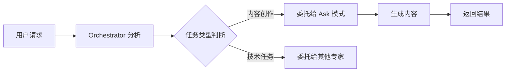

# Orchestrator 任务委托示例

## 概述

本文档展示了 Orchestrator 模式如何分析用户请求并将任务委托给合适的专家模式处理。

## 示例截图

## 场景说明

### 1. 用户请求

用户要求获取一篇关于减脂的小红书文案，具体要求：

- 字数：1300字
- 类型：内容创作任务

### 2. AI 分析过程

Orchestrator 模式对任务进行了以下分析：

- **当前模式**：Orchestrator 模式（负责协调多个任务）
- **任务性质**：内容创作任务，更适合用 "Ask" 模式处理
- **原因**：Ask 模式在内容生成方面能力更强，擅长创作性工作
- **要求**：需要提供清晰的指令和格式说明
- **主题内容**：减脂相关的方法、技巧、经验等

### 3. 系统建议

Orchestrator 给出的处理建议：

- 使用 `new_task` 工具创建新任务
- 将任务委托给 "Ask" 模式的专家处理
- 提供完整的任务上下文和要求
- 说明原因：小红书文案需要专业的内容创作知识，"Ask" 模式更适合

### 4. 输出示例

系统展示了一篇符合要求的小红书减脂文案示例：

**标题**：从120斤到98斤 | 我用了3个月健康减脂22斤的真实分享💪

**内容特点**：

- 真实的个人经验分享
- 具体的数据和时间线
- 健康减脂理念
- 实用的方法和技巧
- 符合小红书文案风格

## 关键要点

### 模式选择原则

- **Orchestrator 模式**：负责任务分析、协调和分配
- **Ask 模式**：适合内容创作、文案生成等创造性任务
- **任务委托**：通过 `new_task` 工具实现模式间的任务传递

### 工作流程

### 最佳实践

1. **明确任务类型**：在分析阶段准确识别任务性质
2. **选择合适模式**：根据任务特点选择最适合的专家模式
3. **清晰的指令**：提供完整的上下文和具体要求
4. **专业分工**：让每个模式专注于其擅长的领域

## 总结

这个示例展示了智能体系统如何通过任务分析和模式选择，将用户请求高效地分配给最合适的处理模块，从而提供更专业、更准确的服务。
